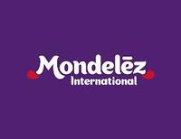

# About Me
## Summary

Computer Engineer with over 15 years of experience in Business Intelligence, Data Engineering, and Data Visualization. Proven expertise throughout the full software development lifecycle: requirements gathering, development, QA, deployment, hypercare, and documentation. Strong background in Microsoft BI Suite, reporting, databases, and programming. Certified Power BI Data Analyst with a results-driven mindset.

## Work Experience

### CEMEX
#### Data Engineer Sr
October 2024 - June 2025 (Remote work)

• Designed and implemented 10+ Power BI reports for multiple markets (supply chain, system log traceability, cloud services spend avoidance, FinOps).  
• Designed and implemented a Snowflake spend avoidance solution in Power BI.   
• Developed 20+ Azure Data Factory pipelines across three key projects.  
• Built Kusto queries (Azure Data Explorer) from system log traceability to support Power BI sources and data pipelines.   
• Maintained and enhanced Snowflake data views to support reporting needs.    

*Skills*: Microsoft Power BI · Snowflake · Azure Data Factory · Azure Data Explorer (KQL) · Microsoft Fabric

### Yale University 
#### Report Visualization Engineer
February 2022 - October 2024 (Remote work)

• Created and maintained reports using Jasper Studio, Argos, and Power BI (demographics, registrar office records, housing survey).   
• Performed data operations with Oracle and SQL Server.   
• Provided ticket-based support using JIRA and ServiceNow.   
• Managed deployment processes via Jenkins pipelines.   
• Authored technical documentation for data flows and processes.   
• Migration of 10+ reports from Brio Query to Power BI Paginated reports for Law School.    
• Creation, update and support to more than 30 Jasper reports.    
• Designed 10 Power BI Reports and 4 paginated reports for GSF project.   

*Skills*: Microsoft Power BI · Oracle SQL Developer · Jasper Reports · Argos Reports · SQL Server Reporting Services (SSRS) · MS SQL Server · Jenkins · Github · Jira

### Mondelēz International
#### Development Development Lead DSD
January 2020 - January 2022 (Remote Work)
  
• Active participation through several markets, across different projects. Delivering solutions for the complete project life cycle: from requirements, analysis, development, testing, automation, deploying and support.   
• BI reports creation, support and management for the Retail Channel, using Power BI & Reporting Services (SSRS).   
• Retail database management, from definition and modeling, to support in SQL Server.   
• ETL processes (SSIS) definition, development, support and management to handle all data in the retail market for BI platform.   
• OLAP Cube (SSAS) support and development for the retail market.   
• Active participation in the definition and support for the Data Warehouse at Sell Out project.   
• Process automation for the retail channel (SSIS, SSAS, SQL, C#). Process monitoring and support.   
• Collaboration with global teams to manage, configure and support the BI Infrastructure.   
• Support to the Mexico BI Platform.   

#### IBS Consultant
June 2018 - December 2019 (Santa Fe, Mexico City)

• Acted as a stakeholder for the Cloud report migration over Business Objects.   
• Collaboration with the team in charge of migration.    

#### IBS WiSE Support
June 2015 - June 2018 (Santa Fe, Mexico City)

• ETL Development to transition from Qo4 provider to WiSE.  
• Reports creation for the new WiSE platform.    
• WiSE support with collaboration of back office support teams.   
• Hypercare for transition.    

#### IBS Sellout Consultant
May 2014 - June 2015 (Santa Fe, Mexico City)

• ETL development for the Sell Out project, to create interfaces to bring data from several sources to the Data Warehouse.   
• Creation, testing and validation of business rules applied in SQL.   

#### IBS DSD Support
May 2013 - May 2014 (Santa Fe, Mexico City)
  
• Support to the MX BI platform for the retail channel.   
• Collaboration with multiple IS teams to provide useful reports to Business Units.    

*Skills*: Microsoft Power BI · SQL Server Integration Services (SSIS) · MS SQL Server · Transact-SQL (T-SQL) · SQL Server Reporting Services (SSRS) · SQL Server Analysis Services (SSAS) · C# · Data modeling · Data Requirement · Service Now 

### HSBC
#### BI Business Analyst
February 2011 - June 2012 (Toluca, Mexico)

• Use of BI Tools to manage the KPIs of the Collections Area
• Creation of functions, store procedures, scripts and data base objects for the LAM environment
• Management for the DEV & PROD environments for LAM
• Development & management of the Reports (SSRS) and ETLs (SSIS) for the daily operation

*Skills*: MS SQL Server · SQL Server Integration Services (SSIS) · Transact-SQL (T-SQL) · SQL Server Reporting Services (SSRS)

### Sistema Estatal de Informática (SEI)
#### BI Business Analyst
December 2009 - February 2011 (Toluca, Mexico)

• Management & Development for the SISER application
• Development for the web application "Indicadores de Gestión" (SSRS & Sharepoint) as well as development and management for the related database
• Development for the web application "Carpeta Informativa" (SSRS, Sharepoint & SQL)

*Skills*: MS SQL Server · SQL Server Integration Services (SSIS) · Transact-SQL (T-SQL) · SQL Server Reporting Services (SSRS) · Sharepoint · ASP
